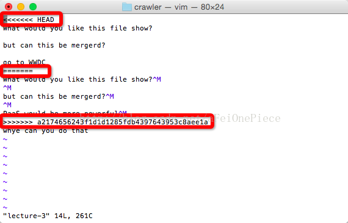

[TOC]

# git-usage


## 配置

``` 账号等配置
git config --global user.email "linghui10@foxmail.com"
git config --global user.name "linghuix"
```

``` 配置别名
git config --global alias.s status     //s -> status
```


## 本地仓库基本操作

```shell
git init                # 新建空仓库
git status              # 仓库工作目录状态观察
git log                 # 历史仓库观察
git diff [file1] [file2]  # 比较文件的不同
```


### Work directory 工作区

```shell
git add [file]                  # 添加工作区文件到暂存区
git rm [file]                   # 删除工作区中的文件，并提交该操作到暂存区
git checkout -- [file]		    # 用Repository的版本替换工作区的版本, 放弃了stage中的内容
git reset [commit-id] --hard    # 工作区文件全部变为旧版本的
```

### Stage 暂存区

```
git commit -m [message]     # 提交暂存区职工的内容到版本库，message可以先不输入右引号直接换行输入
git reset HEAD <file>..."   # 放弃暂存区内容，修改内容依旧存在，即工作区文件内容不会改变
git stash                   # 保存当前暂存区和工作区到 stash 中
git stash pop               # 恢复之前保存的最新的进度到工作区，并删除 stash
git stash apply             # 恢复之前保存的最新的进度，不删除 stash
git stash list              # 显示保存进度的列表
git stash pop stash@{1}     # 恢复指定的进度到工作区。stash_id是通过git stash list命令得到的
git stash clear             # 删除所有存储的进度。
```

###  Repository 版本库

```shell
 # 版本穿越
git reset [commit-id] --soft      # 工作区文件不变,所有改动都待commit，依旧保留所有的版本，回退错误，还可以根据此命令和id返回
git reset [commit-id] --hard      # 工作区文件全部变为旧一个版本的，依旧保留所有的版本

 # 版本比较
git diff commit-id1 commit-id2    ## 比较不同版本之间的差异,id1为改动前,id2为改动后.+++为id2,---为id1,详细格式渊源参见 https://www.ruanyifeng.com/blog/2012/08/how_to_read_diff.html
git diff                          # 比较最新版本+暂存区 与 工作区之间的差异,id1为默认的最新版本+暂存区;方便观察改动情况
# windows使用CR LF作为换行符; Linux使用LF作为换行符。需要让git diff的时候忽略换行符的差异
# https://blog.csdn.net/csfreebird/article/details/10448493
# https://blog.csdn.net/littlehaes/article/details/103568181

 # 版本信息
git log [-5]					  # 获取最新5个commit-id的信息，查看版本库信息
git log [-p] filename             ## 列出某个文件被修改的所有版本id, 后续可以用git show显示所有的改动情况 [-p 可展开显示每次提交的该文件内容差异]
git log --stat				  	  ## 显示版本的文件变动行数，对于bin文件显示字节变动    显示形式: |总行数n ++- 【2/3n是增加的行数，1/3是删除了的行数】
git show --stat <SHA1> | sed -n "/ [\w]\*|/p" | sed "s/|.\*$//"

git show commit-id [filename]     # 某次版本id[某个文件]的具体改动情况,具体显示commit对象的相关信息（提交者，提交时间和commit对象sha-1值等）和上一个提交对象的差异
git show                          ## 最新commit的版本与上一个版本比较信息,与当前工作区是否改动无关!! 与git diff不同!!

 # 仓库结构重建
git rebase origin                 # 将当前分支的起点改为以origin为起点,出现错误时，修改后需要用git rebase --continue. 参考 https://blog.csdn.net/hudashi/article/details/7664631/
git rebase --abort                # 会放弃合并，回到rebase操作之前的状态，之前的提交的不会丢弃；撤销rebase。

git rebase -i id                  # 可以修改比id更新的版本的commit内容，或者合并某些版本仓库，id可以只输入前几位

 # 内容删除
git filter-branch --force --index-filter 'git rm --cached --ignore-unmatch path-to-your-remove-file' --prune-empty --tag-name-filter cat -- --all    # 本地仓库中删除版本库中记录的文件. path-to-your-remove-file是你要删除的文件的相对路径(相对于git仓库的根目录)。 
```


### branches 分支

```shell
git branch name			    # create new branch
git checkout branchname	    # switch to the new branch
git branch -d name		    # delete the branch
```

分支切换时的问题： https://blog.csdn.net/Song_93/article/details/53466646


## 远程仓库操作

> 跟踪分支：概念：建立远程与本地分支的连续，使之保持跟踪即内容一致。git push/pull操作时自动将跟踪的分支进行融合

### 本地仓库与远程仓库的绑定

```shell
 # 建立追踪关系  origin相当于一个变量
ssh:  git remote add [origin] [git@github.com:linghuix/Linux.git]           # 添加远程仓库ssh加密通讯地址，不需要输入密码
http: git remote add [origin] [https://github.com/linghuix/Linux.git]       # 添加远程仓库http地址，需要输入账号，密码
git remote set-url  origin https://github.com/linghuix/markdown.git         # 添加远程仓库http地址
git remote rm origin	                                                    # 删除远程仓库地址 origin 变量

```

### 分支的跟踪

获取远程分支的更多信息

```shell
$ git remote show origin
* remote origin
  Fetch URL: https://github.com/linghuix/make.git
  Push  URL: https://github.com/linghuix/make.git
  HEAD branch: master
  Remote branches:							# 远程分支
    gg     tracked
    master tracked
    test   tracked
  Local branches configured for 'git pull': # git pull 的跟踪信息
    master merges with remote master
    rm     merges with remote test		# rm分支跟踪test分支，使用pull命令时同步。但不能push
    test   merges with remote test		# test分支跟踪test分支，使用pull命令时同步，也可以push
  Local refs configured for 'git push':		# git push 的跟踪信息
    master pushes to master (up to date)
    test   pushes to test   (up to date)
```


查看本地分支 和 【远程对应的分支】
```shell
$ git branch -vv	# 查看设置的所有跟踪分支
* develop  e0e8353 [origin/develop] Initial commit
  feature1 e0e8353 [origin/feature1] Initial commit
  feature2 e0e8353 [origin/feature2] Initial commit
  feature3 e0e8353 [origin/feature3] Initial commit
  master   e0e8353 [origin/master] Initial commit
$ git branch -a	    # 查看远程仓库分支
```


设置已有的本地分支跟踪一个拉取下来的远程分支

```shell
# master分支也必须先用`set-upstream-to`设置本地分支跟踪
# 首先要checkout到要修改的分支上，然后执行
$ git branch -u origin/feature
# 等价于：
$ git branch --set-upstream-to=origin/feature

# 或者不用切换，可以执行
$ git branch -u origin/feature feature
# 等价于：
$ git branch --set-upstream-to=origin/feature feature
```

**注意**：远程和本地相同的分支名字，该命令可以默认直接跟踪。但是不同分支名字，必须指定，但是有时无法跟踪。


### Interaction 交流

**git push <远程主机名> <本地分支名>:<远程分支名>  # 这里的:前后是必须没有空格的。**

```shell

git push origin master 						
# 如果省略远程分支名，则表示将本地分支推送与之存在"追踪关系"的远程分支（通常两者同名），如果该远程分支不存在，则会被新建。将本地的master分支推送到origin主机的master分支。如果后者不存在，则会被新建。

git push origin :master						
# 如果省略本地分支名，则表示删除指定的远程分支，因为这等同于推送一个空的本地分支到远程分支。删除origin主机的master分支。

git push origin								
# 当前分支与远程分支之间存在追踪关系，则本地分支和远程分支都可以省略.将当前分支推送到origin主机的对应分支

git push		
# 当前分支只有一个追踪分支，那么主机名都可以省略

git push -u origin master		
# 如果当前分支与多个主机存在追踪关系，则可以使用-u选项指定一个默认主机，这样后面就可以不加任何参数使用git push。此命令将本地的master分支推送到origin主机，同时指定origin为默认主机，后面就可以不加任何参数使用git push了。


git push -f --set-upstream [origin] [master]  # 远程为空时，可以直接push。push的同时建立跟踪
git pull -f --set-upstream [origin] [master]  # 如果远程不为空，第一次push前必须先pull，-f表示强制。push的同时建立跟踪

git push origin master --force --all
# feature分支只有你一个人在开发, 此时没有其他人会进行提交操作，那么可以直接进行强制推送  ，--force可以直接理解为用你本地分支的状态区覆盖掉远端origin分支的状态，也就是执行过后，本地的分支什么样，远端分支就什么样

git push --force-with-lease
# feature分支有多人开发, 此时如果你贸然的使用--force命令，会有覆盖掉其他人提交代码的风险。比如，小明和小红两个人同时在feature分支上进行开发，小明已经在feature分支上提交了一部分代码，而小红此时执行了rebase操作，所以如果想要推送到远端仓库就必须使用 --force 参数，而小红推送成功之后就会覆盖掉小明提交的代码（前面说过–force就是用本地状态覆盖掉远端状态）。在这种情况下，推荐另外一种更安全的命令, 使用该命令在强制覆盖前会进行一次检查如果其他人在该分支上有提交会有一个警告，此时可以避免改代码的风险. 当出现警告时, 需要git fetch, merge 后再尝试 push.
```


**git pull <远程主机名> <远程分支名>:<本地分支名>**

```shell
git pull <远程主机名> <远程分支名>:<本地分支名>    # pull的作用就相当于fetch和merge，自动合并

git pull --rebase                            # 则是git fetch + git rebase.

git fetch <远程主机名> <远程分支名>  			 # 获取远程分支的最新版本到一个临时的分支，你可以选择做任何事情：merge到本地分支，也可以删除它
```


### 冲突merge

```shell
git merge <本地分支1>		    # merge 本地分支 到 当前所在分支
git merge --abort		    # 抛弃合并过程并且尝试重建合并前的状态。但是，当合并开始时如果存在未commit的文件，git merge --abort在某些情况下将无法重现合并前的状态。
git merge --continue
```




> HEAD 是当前指向的版本
> `<<<<<<`与`========`之间是本地的内容,HEAD当前的版本 ，`=======`与`>>>>>>>>>>`之间的内容是远端/其他版本的
> 后两个红框之间的部分，是origin/master远端的内容。怎么修改决定于你。但是最后要把红框的内容删除


## 公共合作

### 公共版本回退

```shell
git revert commit-id        # 提交一个新的版本,使得版本变成前一个版本
git reset	                # 不适合公共版本的退回。reset会抛弃之前的版本
```

---


[github ssh加密方式的配置](https://help.github.com/en/articles/connecting-to-github-with-ssh)

ssh的秘钥一般放在~/.ssh的隐藏文件中，~/.ssh/中的public秘钥，复制到git服务其中

注意，一对ssh公钥与私钥只能绑定一个仓库！！！！


## ignore

```shell
 # 只管理特定的文件版本，
 *.obj和*.gitignore

 # 忽略所有文件
*
 # 不忽略目录
!*/

 # 不忽略文件.gitignore和*.foo
!.gitignore
!*.obj
```

```shell
 # 忽略管理特定的文件，*.obj 和 库名称/ICEPLAYER目录 

 # 忽略某个目录
/ICEPLAYER/
 
 # 忽略特定的后缀文件
*.obj
```

